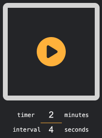

## Mango

Box breathing Google Chrome extension. Mango included. 🥭



### Use

Get it from [Chrome Web Store](https://chromewebstore.google.com/detail/box-breathing/noaeeglcelaeagcinamdhdimncablpfc).

### Develop

```sh
# Install dependencies
npm i

# Spin up a dev server
npm run dev
```

If you want to add it to your Chrome extensions for development, see [load an unpacked extension](https://developer.chrome.com/docs/extensions/get-started/tutorial/hello-world#load-unpacked).

### Publish

```sh
# Build it
npm run build

# Zip it
npm run zip
```

Learn how to [publish to Chrome Web Store](https://developer.chrome.com/docs/webstore/publish).

